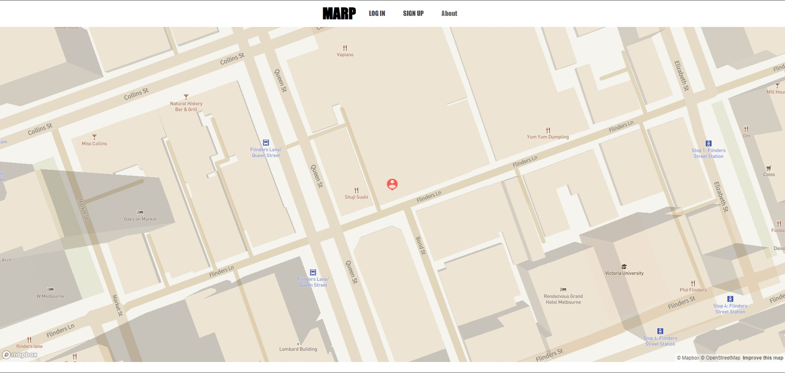

# MARP

## Summary
MERN-based mapping API
  

## Description 
An application for viewing a map with seeded/input values. 

Mongo and GraphQL for seeding and mutations

Express for server, and connecting front-to-back.

React frontend, with React-map-gl and Mapbox for map display.

Node.js for backend connection and helper apps. 
  

## Instructions

### Pre-requisite Installations
Visual Studio  
Node.js  
MongoDB  
MongoDB Atlas  
React  
 

### NPM Dependencies
See package.json for client, server and root files. 
 

### Execution
Client only: npm start from client folder 
Server only: npm start from server folder
Client + Server: npm run develop from root
Web link: http://mabsky05project3.herokuapp.com/

### Usage
Upon loading, App will show base site.

This consists of header with all access information and map with marker at 
default coordinates. 

Logging in with pre-seeded data will load marker at seeded locations. 
Test app with following seeds (Email and password fields required):  

| User | Email | Password |
|------|-------|----------|
|Arthur|art@mail.map| password01|
|Bryan |bry@mail.map| password02|
|Chelsea|che@mail.map|password03|
|Daniel|dan@mail.map|password04|
|Emma|emm@mail.map|password05|

Signing up will provide seeding fields for username, email, longitude, latitude and password.
  

## Contact
grimdango@gmail.com
  

## Log
### 20/05/22 
Good time for branching?

Remaining issues (priority): 
-Fix mutation for longitude, latitude coordinates when creating new user 
-Fix About Page and Link. Include credits. 

Remaining issues (secondary, more complex): 
-Create centering toggle. 
-Draw routes to nearby locations.  
-Add day/night mode via toggle.  

### 20/05/22 
Readme uploaded. 

### 19/04/22
Styling updates.

### 18/04/22
Base app functioning

### 16/05/22
Nodules updated.

### 16/05/22
Fixing untracked files. 

### 16/05/22
Links updated. 

### 16/05/22
Testing via deployment initiated. 

### 15/05/22
Overhaul of links.

### 15/05/22
Maps are working, login to fix.

### 12/05/22
Updates for file organization and structure.

### 12/05/22
Initial upload. 

   

